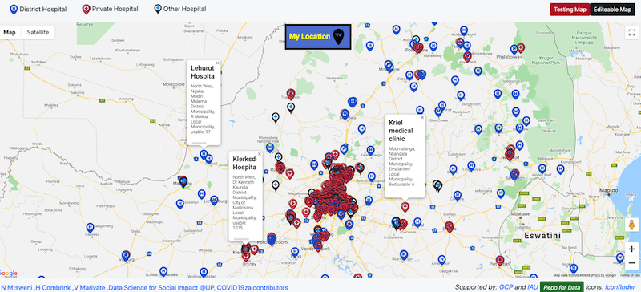

# South African Health Facility Map

Give Feedback 📑: [DSFSI Resource Feedback Form](https://docs.google.com/forms/d/e/1FAIpQLSf7S36dyAUPx2egmXbFpnTBuzoRulhL5Elu-N1eoMhaO7v10w/formResponse)

## Installation

To run this project, you may to have to use jQuery installed as a prerequisite library or use a standard fetch API for data calls. 

After cloning or forking the project, simply replace the Google Maps JavaScript API key with your own key. If you want to use the geolocation feature without the overlaying transparent cover with the text "FOR DEVELOPMENT PURPOSES," make sure your API key is from a Google Cloud account that is enabled for billing.

If you have your own geoJSON data, you can replace the existing data by following the convention of the currently used geoJSON file.

If you have data in CSV format and want to convert it to geoJSON, you can use [this tool](https://www.convertcsv.com/csv-to-geojson.htm)  

## Usage example

The below mentioned use cases make the map helpful for individuals seeking information about health facilities and their capacities in a specific area, aiding in decision-making and resource planning.

1. Viewing Health Facility Bed Capacities: The map allows users to view the bed capacities of health facilities, particularly public and private hospitals, in a specific location. Users can click on markers representing each facility to access more details about that hospital. 

2. Geolocation Feature: The map includes a geolocation feature that allows users to locate themselves on the map. By clicking the "My Location" button, the map centers on the user's current location, providing a convenient way to find nearby health facilities and their bed capacities.

3. Comparing Bed Capacities: The map enables users to compare the bed capacities of multiple health facilities simultaneously. The pop-up info windows associated with each marker can open concurrently, allowing users to gather information from multiple hospitals at once.

This project is just a start, you may suggest more features for this map [here](https://docs.google.com/forms/d/e/1FAIpQLSeMm5zm-syGnw-l06QV2q6caFtNldS3nBsAoIPzs3G2e4-ncg/viewform)

## Development setup

For development, we used Visual Studio Code text editor with a live server extension to get a live preview during build time. However, you can use any text editor and extension of your choice.

To run the project locally (assuming you are using the aforementioned tools), right-click on the HTML file and select the option `"Open with live server" `

## Release History

* 0.0.1
    * First commit and version

## Meta

- Nompumelelo Mtsweni
- Herkulaas MVE Combrink
- Vukosi Marivate [github/@vukosim](https://github.com/vukosim) [twitter/@vukosi](https://twitter.com/vukosi)
- [dsfsi/covid19za contributors and volunteers](https://github.com/dsfsi/covid19za)

See ``LICENSE`` for more information.

## Contributing

1. Fork it (<https://github.com/dsfsi/healthfacilitymap/fork>)
2. Create your feature branch (`git checkout -b feature/fooBar`)
3. Commit your changes (`git commit -am 'Add some fooBar'`)
4. Push to the branch (`git push origin feature/fooBar`)
5. Create a new Pull Request

## Data
The data is from the [dsfsi/covid19za](https://github.com/dsfsi/covid19za) project. The license is [CC 4.0 BY SA](https://github.com/dsfsi/covid19za/blob/master/data/LICENSE.md)

## Citing the work

>@article{mtsweni2020map,
	Author = {Nompumelelo Mtsweni and Herkulaas MvE Combrink andVukosi Marivate},
	journal = {ArXiv e-prints},
	title = {Mapping the South African health landscape in response to COVID-19},
   eprint = {2006.15216},
   archivePrefix={arXiv}, 
   primaryClass={cs.CY}, 
   url = {[https://arxiv.org/abs/2006.15216](https://arxiv.org/abs/2006.15216)}
}

